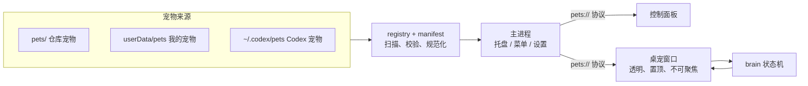

# Pets

宠物仓库 + 桌面端。宠物放在本地的宠物仓库里，桌面端里挑一只，它就会站到你的任务栏上，走来走去、做动作、打盹，可以拖、可以甩、可以点；也可以一键装进 Codex，当 Codex 的宠物用。

## 功能（v0.1）

**宠物仓库**（[`pets/`](pets/)）

- 每只宠物一个文件夹：`pet.json` + 素材。格式说明见 [pets/README.md](pets/README.md)，编辑器补全用 [schema/pet.schema.json](schema/pet.schema.json)。
- 三种素材都能直接用：GIF / APNG / WebP 动图、PNG 帧序列（每帧可设时长和偏移）、精灵图。
- **宠物包不进 Git**：`pets/` 下的宠物文件夹被 `.gitignore` 忽略，只在本地使用；Git 里只有格式说明。
- 兼容 Codex / Petdex 宠物：`pet.json` + 8×9 精灵图的文件夹放进来就能用，`~/.codex/pets` 会被自动识别。

**桌面端**（[`desktop/`](desktop/)，Electron）

- 控制面板：卡片实时播放待机动画，搜索、按来源筛选；详情里逐个预览动画，一键设为桌宠。
- 桌宠：透明、置顶、不占任务栏；待机、走动、随机做动作、打盹；拖动时朝拖动方向迈步，甩出去会带着速度落回任务栏；单击、双击有反应；右键菜单可以点动作、切换宠物、调大小。
- 像素级点击穿透：只有宠物本身挡鼠标，旁边透明的地方照常点到桌面和其它窗口。
- 托盘常驻；记住上次的宠物、位置和设置；可选开机自启。
- 导入宠物文件夹、「我的宠物」目录、多显示器。
- **一键导入到 Codex**：详情里点「导入到 Codex」，把宠物转成 Codex 宠物格式装进 `~/.codex/pets`，见下文。

## 导入到 Codex

控制面板里选中一只宠物，点「导入到 Codex」：

1. 按 Codex 的 9 个状态（待机、向右跑、向左跑、挥手、跳跃、失败、等待、忙碌、审阅）从宠物的动画里取帧。同名状态直接用，常见命名自动对应（如 `wave` → 挥手、`type-keyboard` → 忙碌），没有的用待机；也可以在 `pet.json` 的 `codex` 字段里逐个指定。详情的「信息」里会列出当前的对应关系。
2. 统一缩放进 192×208 的格子、脚底对齐，渲染成 8×9 的精灵图（1536×1872，无损 WebP）。输出能通过 Codex hatch-pet 自带的 `validate_atlas.py` 校验。
3. 写入 `~/.codex/pets/<id>/`（`pet.json` + `spritesheet.webp`）。再点一次会原地更新；不会覆盖不是 Pets 导出的同名宠物。

之后在 Codex 的「设置 → 外观 → 宠物」里选择它，用 `/pet` 唤出或收起。

> Codex 没有提供给外部程序切换当前宠物的接口：当前宠物记在 Codex 自己的内部状态里（运行时会不断改写），所以 Pets 只负责装进去，选择这一步在 Codex 里点一下。

## 快速开始

需要 [Node.js](https://nodejs.org/) 22 或更高版本。

```bash
cd desktop
npm install
npm start
```

把宠物文件夹放进 `pets/`（或启动后用「导入宠物」）。第一次启动会打开控制面板：选一只宠物，点「设为桌面宠物」。以后启动会直接把上次的宠物放回桌面，控制面板从托盘图标打开（右键托盘图标或右键宠物也能退出）。

## 目录结构

```text
Pets/
├─ pets/                    宠物仓库：每个子文件夹一只宠物
│  ├─ README.md             宠物格式说明
│  └─ <id>/pet.json + 素材  只在本地，不进 Git
├─ schema/pet.schema.json   pet.json 的 JSON Schema
├─ desktop/                 桌面端（Electron）
│  ├─ src/main/             主进程：窗口、托盘、菜单、设置、宠物扫描、pets:// 协议、装进 Codex
│  ├─ src/preload/          预加载脚本（只暴露最小 IPC 接口）
│  ├─ src/shared/           纯逻辑：清单校验、行为状态机、Codex 格式（manifest / brain / codex.js）
│  ├─ src/renderer/         控制面板、桌宠窗口、动画播放器、Codex 精灵图导出
│  ├─ scripts/validate-pets.js
│  └─ test/                 单元测试（node --test）
└─ .github/workflows/ci.yml 单元测试 + 宠物校验
```

## 设计要点



- **一套格式，三种素材**：播放器（`renderer/lib/player.js`）把动图、帧序列、精灵图统一成「画框 + 帧」。动图用 `ImageDecoder` 按需逐帧解码，大 GIF 也不占多少内存。
- **脚底锚点**：宠物的位置就是脚底锚点的位置。默认按 idle 第一帧自动算出，个别动画用 `anchor` 微调，所以不同尺寸的 GIF 切换时角色不会跳。
- **窗口即舞台**：桌宠窗口大小能装下所有动画，锚点固定在舞台里；移动宠物就是移动窗口，切换动画不需要改窗口大小。
- **行为状态机**（`shared/brain.js`）是纯逻辑，不依赖 Electron，有单元测试：

  ```text
  待机 ──(随机)──▶ 走动 / 动作 / 睡觉 ──▶ 待机
    ▲                                    │
    └──── 落地 ◀── 下落 ◀── 松手 ◀── 拖动 ◀┘（任何时候都能被拖起）
  ```

- **点击穿透**：窗口默认忽略鼠标，鼠标移到不透明像素上时才接收，读的是当前画面的 alpha。
- **省资源**：默认软件渲染。实测（2× 缩放屏幕，只开桌宠）总私有内存约 220 MB，GPU 进程 20 MB 左右；开硬件加速时 GPU 进程要 300 MB 以上。空闲时 CPU 占用在 0.2% 左右。
- **安全**：渲染进程开启沙箱和上下文隔离；页面和素材都通过 `pets://` 协议提供，素材路径限制在各自宠物文件夹内。

## 开发

```bash
cd desktop
npm test              # 单元测试：清单校验、状态机、宠物扫描、Codex 导出
npm run validate      # 校验 pets/ 下的所有宠物
npm run dev           # 带调试日志启动
```

调试参数：`--pet=bundled/<id>` 启动时直接召唤 `pets/<id>` 这只宠物；`--panel` 总是打开控制面板；`--pets-gpu` 开启硬件加速；环境变量 `PETS_USER_DATA=<目录>` 使用独立的设置目录。

## 路线图

- [ ] 打包成 Windows 安装包（electron-builder）
- [ ] 在线仓库：从 GitHub 拉取宠物列表，在控制面板里一键下载
- [ ] 同时放多只宠物
- [ ] 与 Claude Code / Codex 联动：按 agent 状态（思考、忙碌、等待、失败）播放对应动画。Codex 格式的宠物本来就按这些状态准备了动画
- [ ] 沿窗口边缘攀爬、坐在窗口顶上
- [ ] 宠物制作工具：GIF / 帧序列半自动生成 `pet.json`
- [ ] 导出 Codex v2 格式（需要为每只宠物补 16 个看向方向的姿势）

## 许可

待定。宠物素材不在本仓库中，各自的授权写在对应 `pet.json` 的 `license` 字段。
